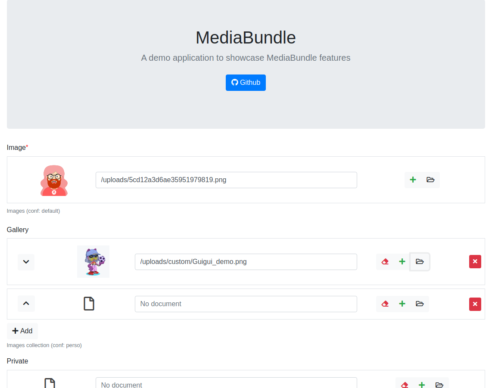

MediaBundle Demo
================

A demo application to showcase the main features of [MediaBundle][1],

How to install this project
---------------------------
     
  1. `git clone git@github.com:artgris/MediaBundleDemo.git media`
  1. `cd media/`
  1. `composer install`
  1. `php bin/console assets:install --symlink`
  1. Edit the `DATABASE_URL` env var in the `.env` file to use your database credentials.
  1. `php bin/console d:d:c --if-not-exists` 
  1. `php bin/console d:s:u --force` 
    
Screenshot
----------

 
[1]: https://github.com/artgris/MediaBundle